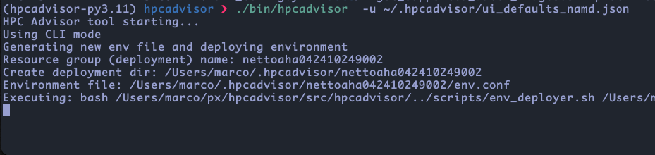
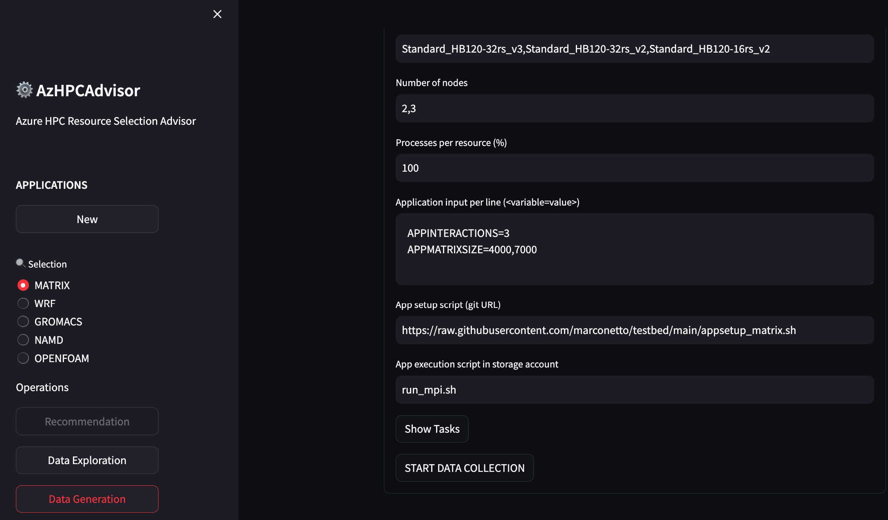
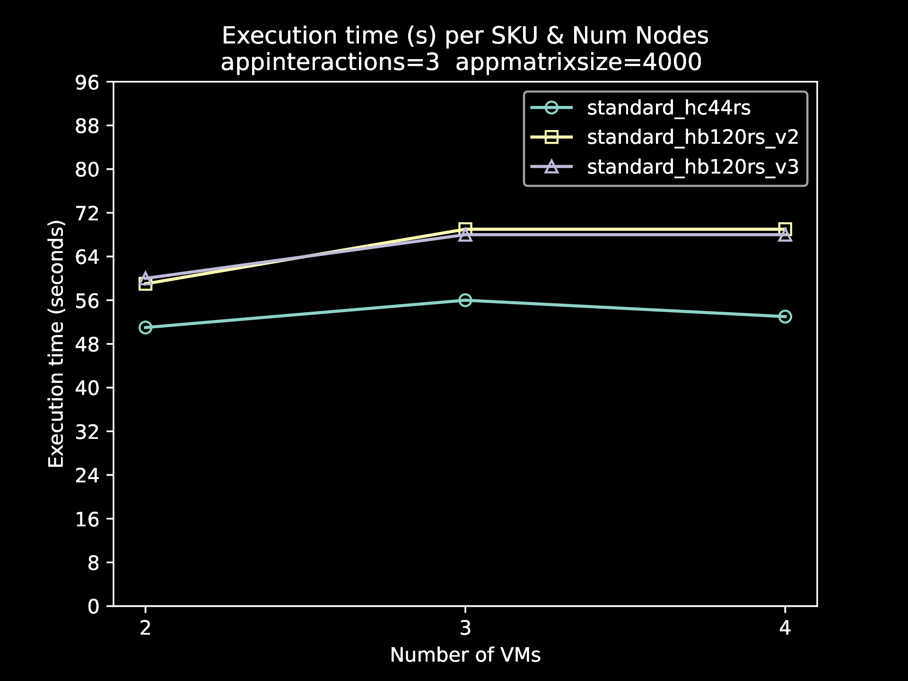
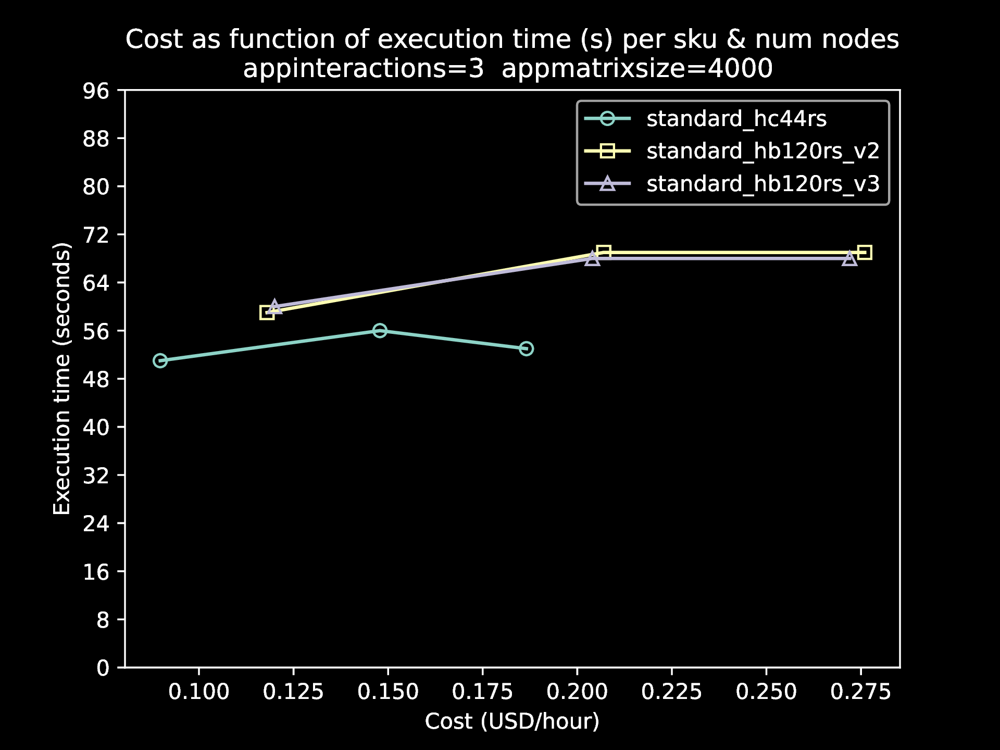

# HPCAdvisor


## Goal


The goal of this tool is to assist users in selecting a cluster configuration
based on actual application executions. Underneath, the execution of the
application is based on resources provisioned by [Azure
Batch](https://learn.microsoft.com/en-us/azure/batch/); but the data collected
can be used to make decisions for other environments including Azure CycleCloud,
Azure VMSS, Azure VMs, AKS, etc.

For now the tool focuses on testing:

- SKUs
- Number of cluster nodes
- Processes per node
- Application input parameters

For next versions we will explore other factors such as storage and gpus in
addition to other features related to avoiding scenarios to optimize unnecessary
tests.


## Operations

The tool offers three operations:

**1.** **Data collector.** Run the application under multiple scenarios to
collect execution times and other metric data (for now cpu usage).

**2.** **Plot generator.** Generate several plots considering the collected
data, including exec time as a function of skus and number of nodes, cost as
a function of skus and number of nodes. In addition, plots all of these metrics
as a function of the application input parameters.

**3.** **Recommendation generator.** Generate the pareto front considering
execution time and costs. We leave to the user to make the final decision that
balances both metrics, as users may be willing to sacrifice execution time in
favor of cost for instance. We also provide as output the best time and best
cost.


In this code we have examples to run tests with actual applications, including
WRF, OpenFOAM, NAMD, and GROMACS. Other apps will become available on the way.

## User interaction (CLI/GUI)

It also has two execution modes (user interaction), one via CLI (Command Line
Interface) and the other via web browser (GUI).


#### CLI screenshot




#### GUI (browser) screenshot




#### Auto-generated plot

Plots are auto-generated and can be seen in the GUI or as files generated via
CLI execution. Here is an example of plot generated for the "Hello World" matrix
multiplication example.


<p float="center">


</p>


#### Auto-generated advice

Advices are represented as tables, which comes from calculation of the
pareto-front considering execution time and costs.

Example of output for the "Hello World" matrix multiplication example.

```
Generating advice...
Appinputs: appinteractions=3  appmatrixsize=4000
Exectime(s)  Cost($/h)    Nodes  SKU
51           0.0898       2      standard_hc44rs

Appinputs: appinteractions=3  appmatrixsize=7000
Exectime(s)  Cost($/h)    Nodes  SKU
126          0.2218       2      standard_hc44rs
```


